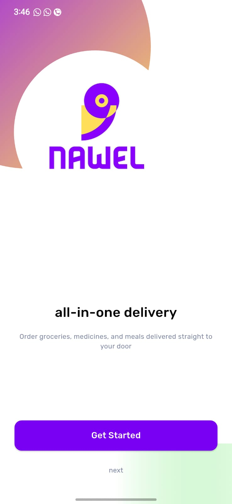
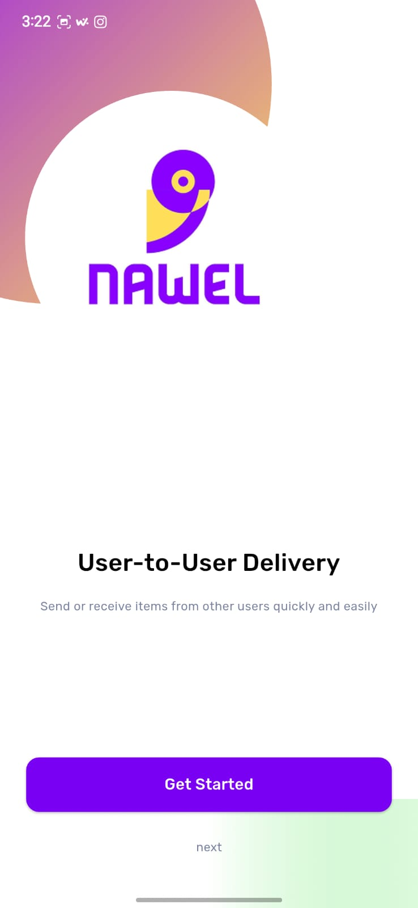
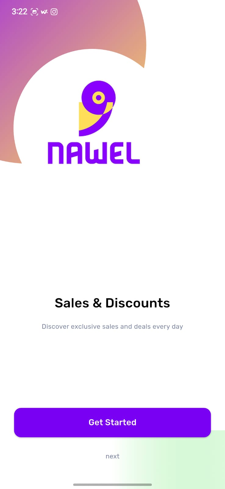
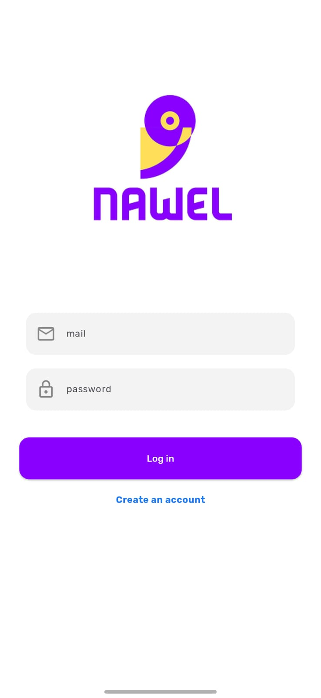
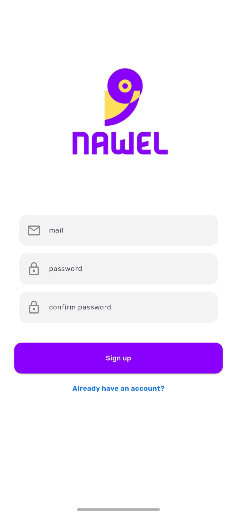
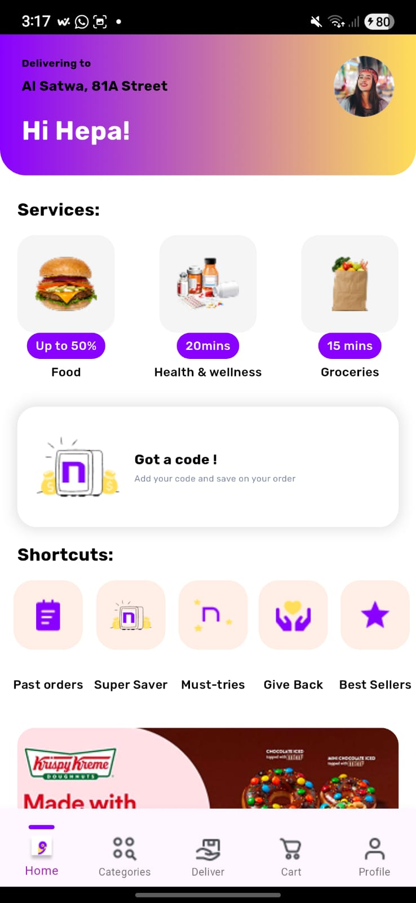
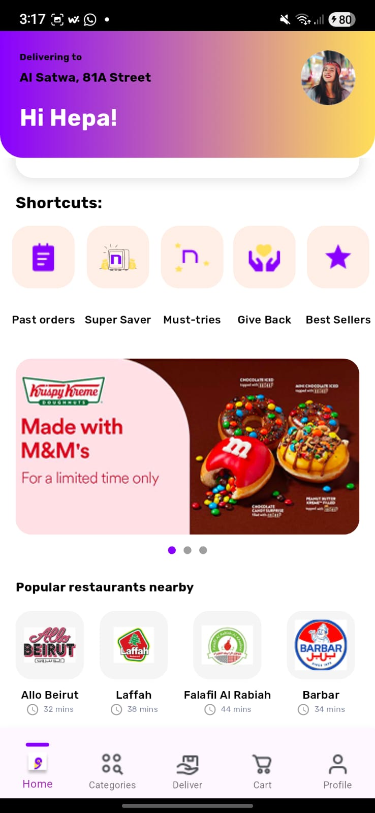

# 🛒 E-Commerce Flutter App

A modern, responsive e-commerce Flutter application built using:
- Firebase Authentication & Firestore
- Hive for local storage
- BLoC pattern
- Clean Architecture
- Custom UI inspired by a delivery/superapp concept

---

## 📸 Screenshots

### Splash Screen  


### Onboarding  




### Login & Signup  



### Home Screen  



---

## 🚀 Features

- 🔐 User authentication (sign up & login) using Firebase
- 🧭 Onboarding screen shown only once using Hive
- 🏠 Home screen with services, shortcuts, promotions, and restaurants
- 🌐 User profile (name & address) fetched from Firestore
- 🎯 Local caching using Hive
- 🧱 BLoC for state management
- 🧼 Clean architecture

---

## 🛠 Project Setup & Installation Guide

### ✅ Prerequisites

- Flutter SDK (3.x)
- Firebase CLI & Project
- Dart-enabled IDE (e.g., VS Code)

---
### 🔧 Clone & Setup

```bash
git clone https://github.com/your-username/flutter-ecommerce-app.git
cd flutter-ecommerce-app
flutter pub get
```

## 🔥 Firebase Integration

1. Create a Firebase project from the [Firebase Console](https://console.firebase.google.com/)
2. Enable **Authentication → Email/Password**
3. Enable **Cloud Firestore**
4. Download the `google-services.json` file from the Firebase Console
5. Place it under `android/app/google-services.json` in your Flutter project
6. Run the following command to configure Firebase:

 ```bash
flutterfire configure
```

### ▶️ Run the App
```bash
flutter pub get
flutter run
```

---

## 🏗 Architecture Overview

### 📂 Clean Architecture Layers

lib/

├── core/ → Constants, utilities, themes

├── data/ → Remote & local data sources

├── domain/ → Entities and use cases

├── presentation/ → UI widgets, BLoCs, screens


---

## 📦 State Management

- **BLoC** is used for onboarding, authentication, and home features.
- All states are immutable and use `copyWith` and `Equatable` for consistency.

---

### Firebase Usage Summary
  - Authentication: Handles secure user login and sign-up
  - Cloud Firestore: Stores user data like name and address 
  - Cloud Storage: Ready for future media upload needs
  - Hive: Caching for onboarding screen and future offline features
   
---

 ###  Rationale
 - ✅ BLoC ensures maintainable, testable state flow
 - ✅ Clean Architecture separates concerns clearly
 - ✅ Hive enables fast and persistent offline experience
 - ✅ Firebase offers scalable backend services
 - ✅ Responsive design ensures compatibility across devices

---

### 📚 Key Dependencies
 - cupertino_icons: ^1.0.8
 - google_fonts: ^6.2.1
 - smooth_page_indicator: ^1.1.0
 - hive_flutter: ^1.1.0
 - equatable: ^2.0.7
 - flutter_bloc: ^9.1.1
 - firebase_core: ^3.14.0
 - firebase_auth: ^5.6.0
 - cloud_firestore: ^5.6.9


